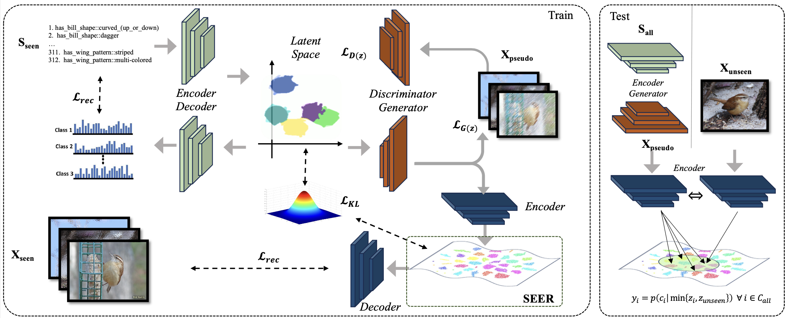

# SEER-ZeroShotLearning
Code repository to the paper SEER: Semantic Encoded Enhanced Representation Zero-Short learning. 

The could well be made public here after publication, for early access please send an request to william.heyden@nmbu.no.

