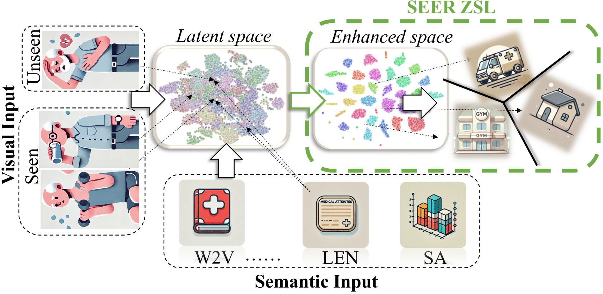

# SEER-ZeroShotLearning
Code repository to the paper SEER: Semantic Encoded Enhanced Representation Zero-Short learning. 

Zero-Shot Learning (ZSL) presents the challenge of identifying categories not seen during training. This task is crucial in domain where it is costly, prohibited, or simply not feasible to collect training data. ZSL depends on a mapping between the visual space and available semantic information. Prior work learns a mapping between the spaces that can be exploited this during inference. 
We contend, however, that the disparity between meticulously curated semantic spaces and the inherently noisy nature of real-world data remains a substantial and unresolved challenge.
In this paper, we address this by introducing of a Semantic Encoder-Enhanced Representations for Zero-Shot Learning (SEER-ZSL). We propose a hybrid strategy to address the generalization gap. Firstly, we aim to distill meaningful semantic information using a probabilistic encoder, enhancing the semantic consistency and robustness.
Secondly, we distill the visual space by exploiting the learned data distribution through an adversarially trained generator. Finally, we align the distilled information enabling a mapping of unseen categories onto the true data manifold. We demonstrate empirically that this approach yields a model that outperforms the state-of-the-art benchmarks in terms of both generalization and diverse settings using small, medium, and large datasets.

